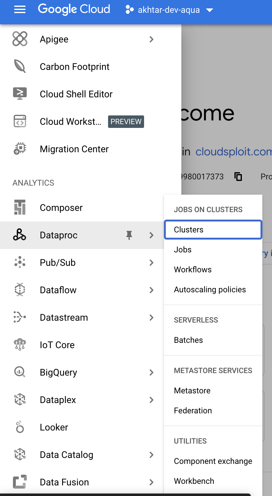
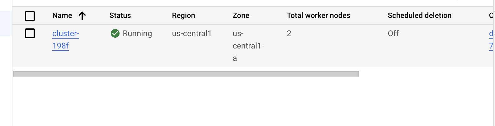
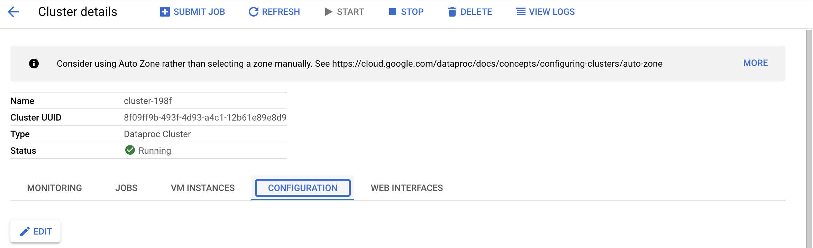
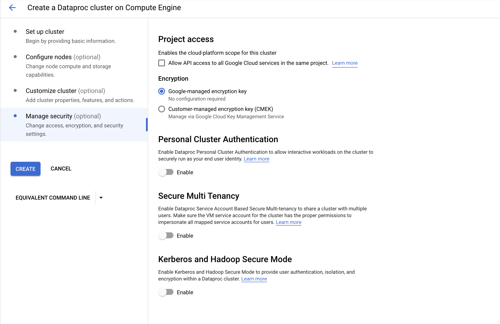
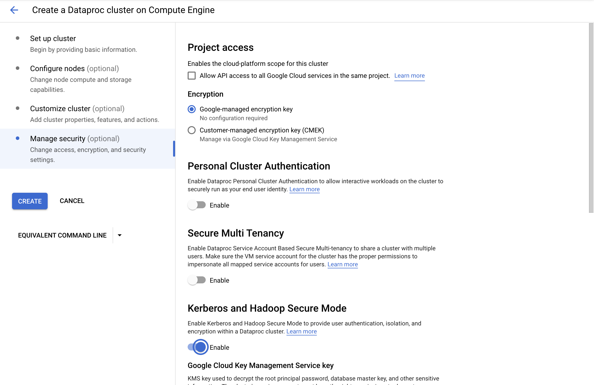
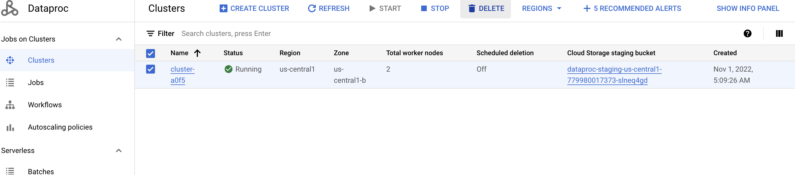
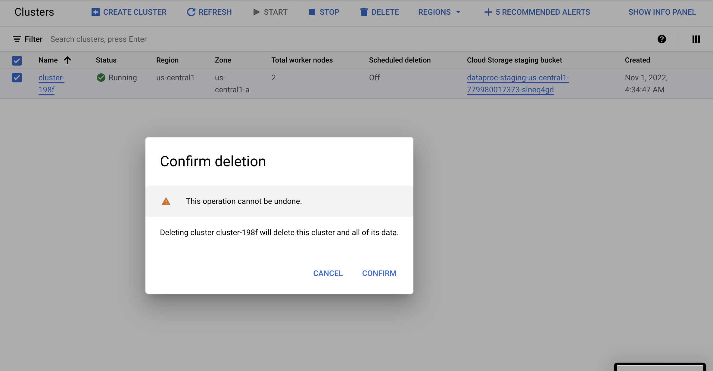

# Google / Dataproc / Hadoop Secure Mode Enabled

## Quick Info

| | |
|-|-|
| **Plugin Title** | Hadoop Secure Mode Enabled |
| **Cloud** | Google |
| **Category** | Dataproc |
| **Description** | Ensure that all Dataproc clusters have hadoop secure mode enabled. |
| **More Info** | Enabling Hadoop secure mode will allow multi-tenancy with security features like isolation, encryption, and user authentication within the cluster. It also enforces all Hadoop services and users to be authenticated via Kerberos Key distribution. |
| **Google Link** | https://cloud.google.com/dataproc/docs/concepts/configuring-clusters/security |
| **Recommended Action** | Enable hadoop secure mode for all dataproc clusters. |

## Detailed Remediation Steps
1. Log into the Google Cloud Platform Console.
2. Scroll down the left navigation panel and choose "Dataproc" to select the "Clusters" option.   
3. On the "Clusters" page, select the cluster which needs to be verified whether it has Hadoop Secure Mode enabled or not by clicking on its name.  
4. On the "Cluster details" page, click on the "Configuration" tab.   
5. Scroll down and check the value of "Advanced security". If "Advanced security" is "disabled" then the cluster does not have Hadoop Secure Mode enabled.  
6. Repeat step number 2 - 5 to verify other "Clusters" in the project. 
7. Navigate to "Dataproc" and choose "Clusters", and click on the name of the "Cluster" that needs to have Hadoop Secure Mode enabled to go to the "Cluster details" page.  
8. From the "Cluster details" page, collect all the configuration information for the cluster. 
9. Go back to the "Clusters" page and click the "Create Cluster" button at top.  
10. On the "Create Cluster" page, add all the configuration information of the old cluster and then click on "Manage Security" tab on the left-side.  
11. Under "Kerberos and Hadoop Secure Mode", click on the slider next to "Enable" to enable Hadoop Secure Mode for the cluster.  
12. Click the "Create" button on left side to create a new dataproc cluster with Hadoop Secure Mode enabled.  
13. Once the new "Cluster" is created, delete the old cluster by clicking on the checkbox next to its name and then clicking on the "Delete" button at the top.  
14. Confirm the deleteion by clicking on the "Confirm" button in the "Confirm deletion" popup.  
15. Repeat steps number 7 - 14 to recreate all the Dataproc "Clusters" in the project with Hadoop Secure Mode enabled. 

