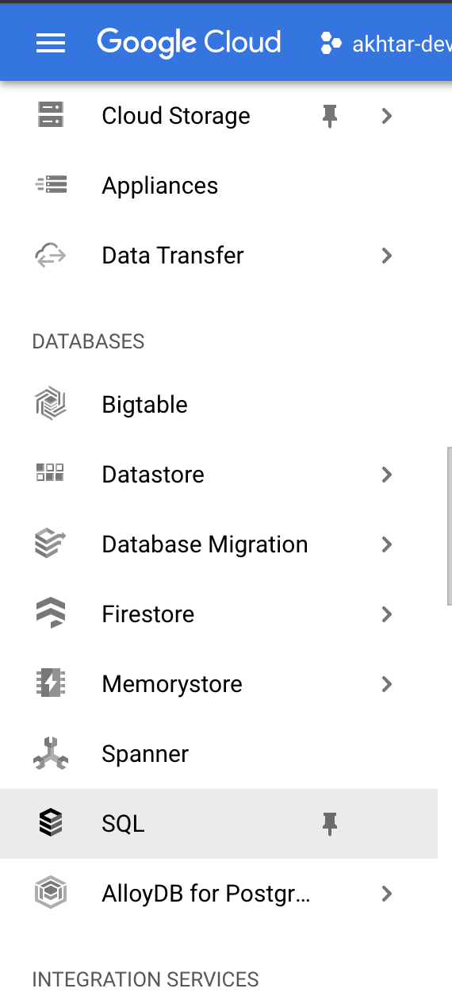
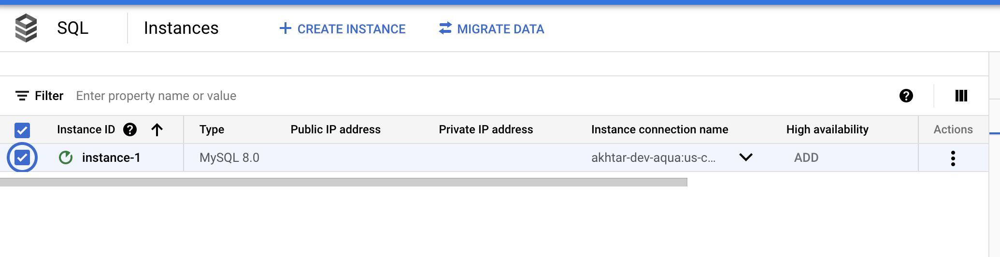
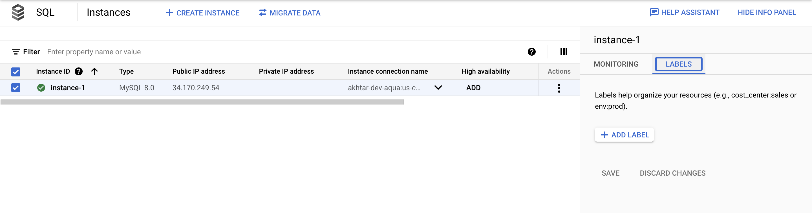
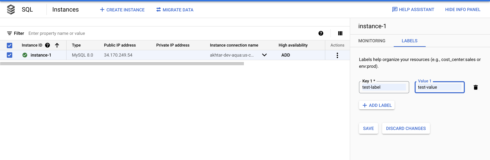

# GOOGLE / SQL / SQL Instance Labels Added

## Quick Info

| | |
|-|-|
| **Plugin Title** | SQL Instance Labels Added |
| **Cloud** | GOOGLE |
| **Category** | SQL |
| **Description** | Ensures SQL database instances have labels added. |
| **More Info** | Labels are a lightweight way to group resources together that are related to or associated with each other. It is a best practice to label cloud resources to better organize and gain visibility into their usage.Labels are a lightweight way to group resources together that are related to or associated with each other. It is a best practice to label cloud resources to better organize and gain visibility into their usage. |
| **GOOGLE Link** | https://cloud.google.com/sql/docs/mysql/label-instance |
| **Recommended Action** | Ensure labels are added for all SQL databases. |

## Detailed Remediation Steps
1. Log into the Google Cloud Platform Console.
2. Scroll down the left navigation panel and click on "SQL".   
3. On the "SQL" page, select the SQL Instance which needs to be verified whether it has labels added or not by clicking on the checkbox next to its name.  
4. From the panel on the right side, select "Labels" and check if there are any labels shown. If not, the SQL Instance does not have labels added.  
5. Repeat steps number 3-4 to check other SQL Instances in the project. 
6. Navigate to "SQL" and click on it. From the panel on the right side, click on "Labels" and then click on the checkbox next to the name of the "SQL Instance" which needs to have labels added.  
7. Click on "Add Label", and add key and value for the label. Add as many labels as you want and then click "Save".  
8. Repeat steps number 7-8 to add labels to all other SQL Instances in the project. 
